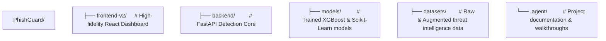

# 🛡️ PhishGuard Enterprise

## Next-Generation AI Threat Defense & Forensics

**PhishGuard** is an institutional-grade security intelligence platform designed for the modern enterprise. It leverages a hybrid detection core—combining **XGBoost Machine Learning**, **Computer Vision**, and **Neural Language NLP**—to provide high-fidelity protection across the entire digital perimeter.

  

---

## ✨ Enterprise Core Features

### 🔍 Multi-Modal Detection Core

- **AI Forensics**: Real-time transparency with a dedicated **Forensics Modal** showcasing ML confidence scores and specific rule-based matches.
- **Hybrid URL Engine**: High-precision scanning using an **XGBoost** model trained on 20k+ global and localized (Indian) threat samples.
- **Advanced Vision**: Real-time QR code (Quishing) and image-based threat analysis via OpenCV and Pillow.
- **NLP Email Auditor**: Deep-packet inspection of email headers and bodies for social engineering and spoofing patterns.

### 🌐 Real-Time Surveillance

- **Interactive Threat Map**: A 3D holographic globe (Three.js) visualizing active global phishing campaigns and surveillance feeds.
- **Single-Page Monitoring (SPM)**: A condensed, zero-scroll dashboard designed for security operations centers (SOCs).

### ⚡ Professional User Experience

- **Motion System**: Staggered entrance sequences and gliding transitions powered by **Framer Motion**.
- **Glassmorphism Design**: High-fidelity dark mode aesthetic with clean typography (Inter/Manrope) and tactile micro-interactions.
- **Security Audit Trail**: Comprehensive history module for granular tracking of past threat assessments.

---

## 🛠️ Technology Architecture

| Layer | Technology |
| :--- | :--- |
| **Frontend** | React 18, Vite, Tailwind CSS 4, Framer Motion |
| **Backend** | Python 3.9+, FastAPI, Uvicorn |
| **Intelligence** | XGBoost, Scikit-Learn, Pandas, NumPy |
| **Vision** | Headless OpenCV, Pillow |
| **Database** | MongoDB (Configuration & History Logs) |
| **Deployment** | Docker-ready with optimized containerization |

---

## 🚀 Quick Start

### 1. Requirements

- Node.js 18+
- Python 3.9 - 3.12
- MongoDB (Local or Atlas)

### 2. Frontend Launch

```bash
cd frontend-v2
npm install
npm run dev
```

*Access the high-fidelity dashboard at `localhost:5173`*

### 3. Backend Engine

```bash
cd backend
pip install -r requirements.txt
# Set your PHISHGUARD_API_KEY environment variable
uvicorn phishguard.api.app:app --reload
```

---

## 📂 Project Structure




---

## ⚖️ License

Licensed under the MIT Enterprise License.

## 🏛️ Development

Crafted with precision for secure enterprise environments by **Satyam Raghuvanshi**.
